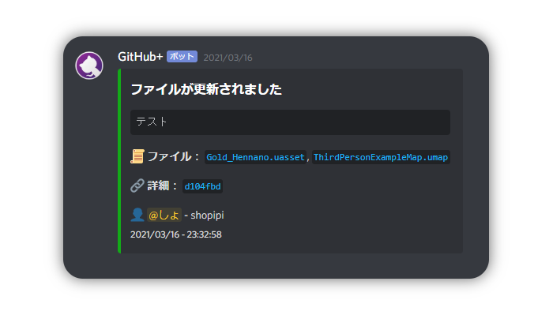

<h1 align="center">GitHub+ BOT for Discord</h1>

  <a href="#overview">Overview</a> |
  <a href="#usage">Usage</a> |
  <a href="#reference">Reference</a>

  

# Overview
- 💬 コミットメッセージと更新があったファイル名を表示します。
- 🤐 プライベートレポジトリ対応。
- 🤖 Webhookのメッセージから更新を読み取ります。

# Usage
- Webhookを設定
- [Discord4J](https://www.javadoc.io/doc/com.discord4j/Discord4J/2.10.1/index.html)を使用
- [`sendChannelId`](https://github.com/shopipi/GitHubPlus/blob/main/src/com.github.shopipi.githubplus/Main.java#L17)でチャンネルIDを指定 ([Main.java](https://github.com/shopipi/GitHubPlus/blob/main/src/com.github.shopipi.githubplus/Main.java))
- [`GitHubAPI`](https://github.com/shopipi/GitHubPlus/blob/main/src/com.github.shopipi.githubplus/GitHubMessageListener.java#L68)でパーソナルアクセストークン、Owner名、repo名、branch名を指定 ([GitHubMessageListener.java](https://github.com/shopipi/GitHubPlus/blob/main/src/com.github.shopipi.githubplus/GitHubMessageListener.java))
- Webhookを設定したサーバーとBOTのログを出すサーバーの両方にBOTを入れる

# Reference
- https://stackoverflow.com/questions/45726013/how-can-i-get-last-commit-from-github-api
- https://living-sun.com/ja/java/464414-execute-curl-from-java-with-processbuilder-java-json-curl-processbuilder-django-rest-framework.html
